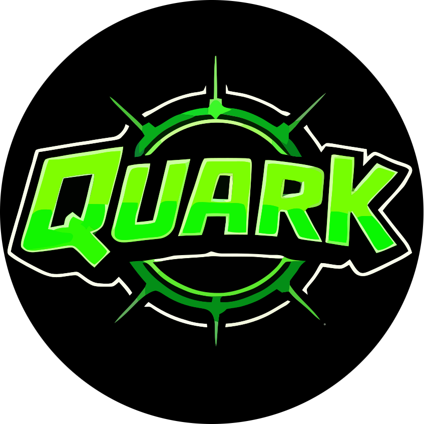

# Quark



Quark is a C-written framework to build universal apps using web technologies.

The goal of this project is to make desktop/console development accessible to anyone with (even little) knowledge in web development.

Right now it can be used to write **ps vita** and **GNU/Linux** apps using **HTML/CSS** and **JavaScript**.

Example apps are available in the *examples* directory.

> **Note** : It is a very early version and some things **will** break and not be supported. Please write issues and pull requests if you encounter bugs or can help participate in the project!

---

## Setup

### Requirements

- vita-sdk
- curl
- tar
- unzip
- make
- cmake

#### External Libraries Required

- lexbor (HTML Parsing)
- duktape (JavaScript Engine)

Those libraries are installed by `setup.sh`.

### GNU/Linux Setup

Run `./setup.sh` which will setup source code dependencies.

### Vita lib install

Before building your VPK apps, you will also need to install the SDL_ttf lib to your vita-sdk :

- https://github.com/devnoname120/SDL_ttf-Vita.git

And the SDL_Image lib for the vita using :

```bash
make -f Makefile.psp2; make -f Makefile.psp2 install
```

### VPK Build (PS Vita)

Then, to work on a new project, you can either start anew or copy one of the examples.

Create a new **projects** directory, then create a **new directory inside** for your project with the name of your choice!

In the directory of your app, run :

```
./build.sh
```

And voilà! You should have a working .vpk file that you can install on your console or run in an emulator.

### GNU/Linux build

To build a GNU/Linux version of your app (for debugging or to support desktop uses for instance),
in the main quark directory, run :

```
make -f Makefile.Linux
```

Then, copy the `quark` binary to the location of your `index.html` and `style.css` files.

You will also need to have `Sans.ttf` and `quark.js` in the same directory as this binary!

---

## What works

### HTML

- div
- p
- body
- head
- h1,h2,h3,h4
- img
- script (only direct scripts in the tags, the *src* attribute isn't supported at the moment)

### JS

- document.getElementById
- document.addEventListener
- element.style (not all style attributes)
- element.innerText
- element.innerHTML
- element.attributes (not all attributes)
- onclick
- setInterval
- setTimeout
- window.location (set)
- Keyboard, touchscreen, click and gamepad events

### CSS

- display: inline and block
- font-size
- color
- background-color
- padding
- margin
- height
- width
- text-align
- vertical-align
- position: 

---

## To Do

- Add image cache (different from texture cache)
- Support external resources loading in HTML (such as JSON/JS/CSS files)

---

## Known bugs

- Negative padding (and probably margin) crashes Quark

---

### Objectives

Enhance JS/HTML support to support projects like :

- https://github.com/burakcan/jsgs/blob/master/src/Screen/index.js
