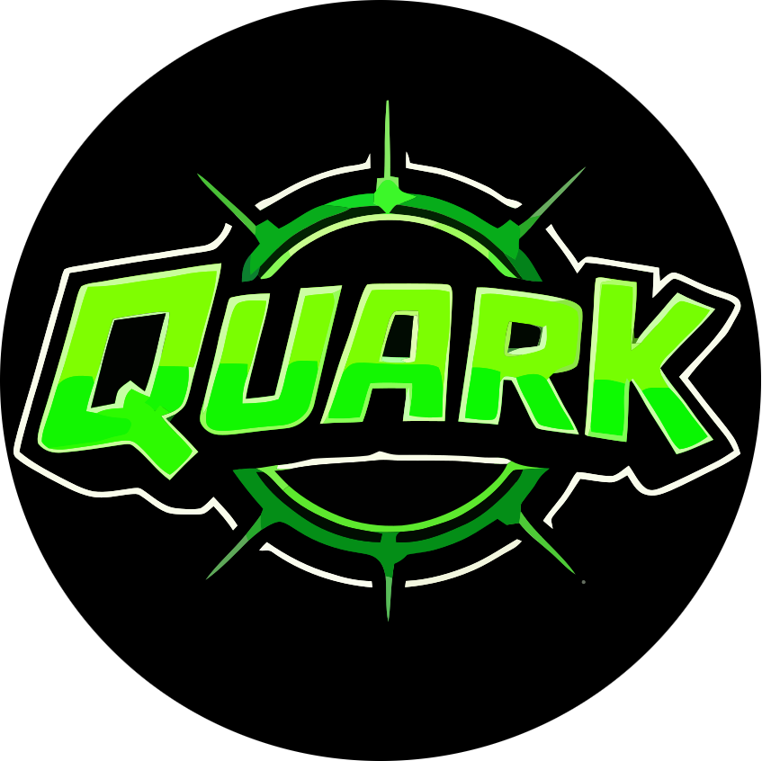

# Quark



Quark is a C-written framework to build universal apps using web technologies.

The goal of this project is to make desktop/console development accessible to anyone with (even little) knowledge in web development.

Right now it can be used to write **ps vita** and **GNU/Linux** apps using **HTML/CSS** and **JavaScript**.

Example apps are available in the *examples* directory.

> **Note** : It is a very early version and some things **will** break and not be supported. Please write issues and pull requests if you encounter bugs or can help participate in the project!

---

## Docker Setup

As of today, the Docker setup is the easiest to get started regardless of your OS, the Dockerfiles in this project should package everything you need to run and debug your quark projects in a few minutes.

### Building the image you need

As of today, there is three available Dockerfiles to help you build three different images depending on what you need to achieve.  

**For each of the docker build commands below, run them from the root of this repository!**

#### CLI only

The default CLI interface, use it to build .vpk files from your project directory.

Build the image with:

```bash
docker build -f ./Dockerfiles/Dockerfile -t quark:0.1 .
```

Then, build your own quark project with:

```bash
docker run --rm -v {your_project_directory}:/quark/projects/project -it quark:0.1 /quark/projects/project/
```

> For the moment, the build scripts absolutely need your project to be in `/quark/projects/{your_project}` or `/quark/examples/{your_project}`!

Your new *.vpk* files will be created in {your_project_directory}, you can new install them on your PS Vita or in your own emulator!

#### X11 Quark

If you want to use the Linux version of quark and render your project natively using a VNC server, build the VNC version with:

```bash
docker build -f ./Dockerfiles/Dockerfile_X11 -t quark:0.1-vnc .
```

Then, run your project in a quark window with :

```bash
docker run --rm -p 127.0.0.1:5900:5900 -v {your_project_directory}:/quark/projects/project -it quark:0.1-vnc /quark/projects/project/
```

The prompt will ask you to setup a password. 
Once you're done you can connect to `127.0.0.1:5900` using the password you specified with the VNC client of your choice!


#### Vita3k Emulator

Finally, this one will install the Vita3K emulator along VNC, build your project and then run your (if the build was successful) compiled .vpk file in the emulator.

```bash
docker build -f ./Dockerfiles/Dockerfile_X11_Vita3k -t quark:0.1-vita3k .
```

Build and run your project with:

```bash
docker run --rm -p 5900:5900 -v {your_project_directory}:/quark/projects/project -it quark:0.1-vita3k /quark/projects/project/
```

Here too, the prompt will ask you to setup a password. 
Once you're done you can connect to `127.0.0.1:5900` using the password you specified with the VNC client of your choice!

---

## Local Setup

### Requirements

- vita-sdk
- curl
- tar
- unzip
- make
- cmake

#### External Libraries Required

- lexbor (HTML Parsing)
- duktape (JavaScript Engine)

Those libraries are installed by `setup.sh`.

### GNU/Linux Setup

Run `./setup.sh` which will setup source code dependencies.

### Vita lib install

> **Note**: It seems that this step is not required on the latest VitaSDK versions, this will be left here for reference.

Before building your VPK apps, you will also need to install the SDL_ttf lib to your vita-sdk :

- https://github.com/devnoname120/SDL_ttf-Vita.git

And the SDL_Image lib for the vita using :

```bash
make -f Makefile.psp2; make -f Makefile.psp2 install
```

### VPK Build (PS Vita)

Then, to work on a new project, you can either start anew or copy one of the examples.

Create a new **projects** directory, then create a **new directory inside** for your project with the name of your choice!

In the directory of your app, run :

```
./build.sh
```

> **Note**: The ./build.sh can be copied and adapted from the examples! Same for the other required build files.

And voilà! You should have a working .vpk file that you can install on your console or run in an emulator.

### GNU/Linux build

To build a GNU/Linux version of your app (for debugging or to support desktop uses for instance),
in the main quark directory, run :

```
make -f Makefile.Linux
```

Then, copy the `quark` binary to the location of your `index.html` and `style.css` files.

You will also need to have `Sans.ttf` and `quark.js` in the same directory as this binary!

---

## What works

### HTML

- div
- p
- body
- head
- h1,h2,h3,h4
- img
- script (only direct scripts in the tags, the *src* attribute isn't supported at the moment)

### JS

- document.getElementById
- document.addEventListener
- element.style (not all style attributes)
- element.innerText
- element.innerHTML
- element.attributes (not all attributes)
- onclick
- setInterval
- setTimeout
- window.location (set)
- Keyboard, touchscreen, click and gamepad events

### CSS

- display: inline and block
- font-size
- color
- background-color
- padding
- margin
- height
- width
- text-align
- vertical-align
- position: 

---

## To Do

- Add image cache (different from texture cache)
- Support external resources loading in HTML (such as JSON/JS/CSS files)

---

## Known bugs

- Negative padding (and probably margin) crashes Quark

---

### Objectives

Enhance JS/HTML support to support projects like :

- https://github.com/burakcan/jsgs/blob/master/src/Screen/index.js
